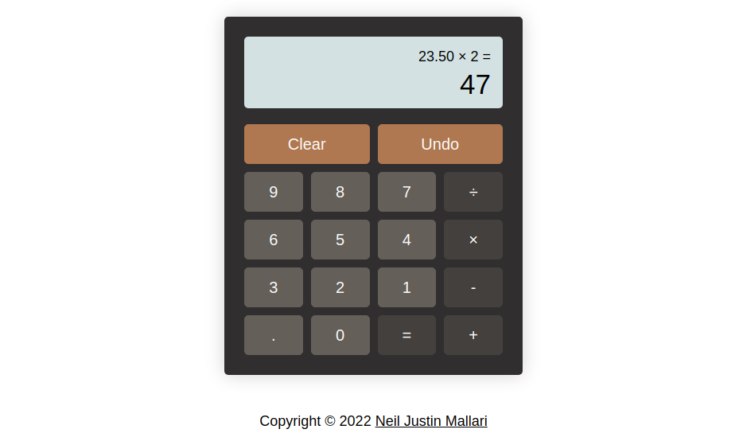

# Calculator
An online calculator that works with basic arithmetic operations and supports working with decimal numbers.

## Preview
See the game for yourself by clicking [this](https://neil-justin.github.io/calculator/)

## Objectives
- Evaluate a complex expressions (more than two operands and operators) accurately.
- Write an algorithm that shields user from potential bugs when evaluating a complex expressions.

## Acknowledgments
- This project was made possible by [The Odin Project](theodinproject.com) — a community-supported, open-source website that teaches full-stack web development for free.
- The UI design was inspired from Casio MS20B.